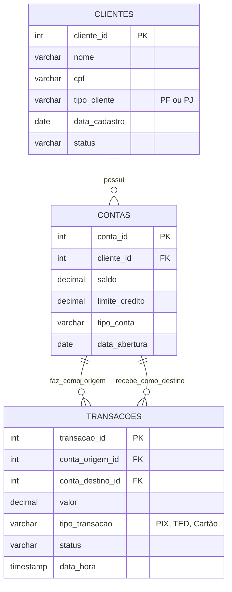

# Fintech Data Analytics Portfolio - PostgreSQL

Um banco de dados completo e funcional simulando a operação de um Banco Digital (Fintech). O objetivo deste projeto é demonstrar proficiência em **SQL Analítico** direcionado à resolução de problemas complexos de negócios financeiros, englobando modelagem de dados, ingestão de registros e geração de *insights* operacionais.

## Contexto de Negócio

No setor financeiro, milhões de registros são gravados a cada minuto. A tomada de decisão precisa ser pautada em consultas robustas e seguras. Este projeto resolve três problemas de negócios principais enfrentados por Instituições de Pagamento:
1. **Compliance e Risco:** Identificação precoce de indícios de fraude (Lavagem de Dinheiro) buscando fluxos atípicos rápidos.
2. **Finanças e Auditoria:** Tracking de reconciliação para comprovar saldos cumulativos dia a dia dos usuários.
3. **Engajamento e Retenção:** Identificação de churns (contas dormentes a mais de 30 dias) para campanhas de marketing reativo.

## Modelagem de Dados (ERD)

A modelagem é simplificada para priorizar as operações transacionais (*OLTP bias*) em um ambiente RDBMS em terceira forma normal (3NF).

## Como Executar Localmente

Você precisará de um SGBD PostgreSQL rodando localmente (ou Docker). Siga a ordem dos scripts da pasta:

1.  Execute **`01_schema_e_tabelas.sql`** para construir as tabelas e as `Constraints`.
2.  Execute **`02_dados_ficticios.sql`** para inserir o repositório de clientes, contas e transações (projetado matematicamente para testar nossas regras de negócio).
3.  Estude e execute linha a linha o arquivo **`03_consultas_analiticas.sql`**.

## Soluções em SQL Empregadas

As consultas do arquivo `03_consultas.sql` foram desenhadas demonstrando:
*   `Window Functions` (`LAG`, `OVER()`, `PARTITION BY`) para controle de estados sequenciais sem a necessidade de lops.
*   `Common Table Expressions` (`CTEs`) para legibilidade, dividindo tarefas complexas de agregações em etapas.
*   `Agregações Avançadas` e manuseio cirúrgico de tipos primitivos como `TIMESTAMP` e `INTERVAL`.

## Resultados e Insights em Destaque

Neste projeto geramos uma massa de dados fictícia (`02_dados_ficticios.sql`) desenhada estrategicamente para testarmos as regras de negócio em ação. Abaixo estão os resultados das consultas construídas executadas no motor (*Outputs*):

### 1. Detecção de Padrão de Fraude (Lógica de Tempo)
O código busca anomalias (uma mesma conta com múltiplas transferências seguidas num intervalo curtíssimo). Usando as *Window Functions* (`LAG`), testamos se 3 transações acontecem em menos de 10 minutos para contornar limites transacionais:

| conta_origem_id | nome          | inicio_onda_fraude  | fim_onda_fraude     | intervalo_minutos |
| :-------------- | :------------ | :------------------ | :------------------ | :---------------- |
| 5               | Mariana Costa | 2024-03-29 23:01:00 | 2024-03-29 23:08:00 | 7.0               |

> **Insight:** A query flagrou automaticamente o comportamento da "Mariana", que realizou um pico de 3 transferências PIX pesadas numa tentativa de repasse em apenas *7 minutos*. O alerta é imediato para o time de Compliance agir na trava da conta!

### 2. Conciliação de Saldo Cumulativo Diário
Uma query de de nível intermediário-avançado gerando o histórico diário financeiro com cálculo base de movimentações aplicadas a um *Running Total* (`SUM(SUM) OVER()`):

| conta_id | nome        | data_movimentacao | saldo_do_dia | saldo_cumulativo_historico |
| :------- | :---------- | :---------------- | :----------- | :------------------------- |
| 1        | Ana Silva   | 2024-03-15        | -500.00      | -500.00                    |
| 1        | Ana Silva   | 2024-03-16        | 150.00       | -350.00                    |
| 1        | Ana Silva   | 2024-03-25        | -50.00       | -400.00                    |
| 3        | Empresa XYZ | 2024-03-15        | 500.00       | 500.00                     |
| ...      | ...         | ...               | ...          | ...                        |

> **Insight:** Independente de ser um débito (PIX enviado) ou crédito (PIX recebido em self-join implícito), a estrutura sumariza a balança diária e traça um controle total que bate exato no fechamento de caixa do dia contábil da Instituição de Pagamento.

### 3. CRM E Retenção: Onde estão os inativos (Churn)?
Como identificar rapidamente clientes dormentes? A query usa de um `LEFT JOIN` para filtrar transações ativas e manipulação de `INTERVALOS` com *timestamps* para isolar contas sem movimentação a +30 dias:

| cliente_id | nome         | conta_id | data_ultima_transacao | dias_inativo |
| :--------- | :----------- | :------- | :-------------------- | :----------- |
| 5          | João Peixoto | 6        | 2023-10-01 12:00:00   | 180          |
| 4          | Mariana      | 5        | *NULL*                | *NULL*       |

> **Insight:** Detectada uma inatividade de exatos 180 dias do cliente "João" (conta Churn "purista"), e listagem *NULL* para contas recém criadas que sequer fizeram uma ativação primária. Base riquíssima que pode ser exposta ao time de Performance de Marketing para disparo de *Push Notifications* de resgate automatizado!

---
*Este projeto é parte de um Portfólio focado na engenharia e análise de dados.*
